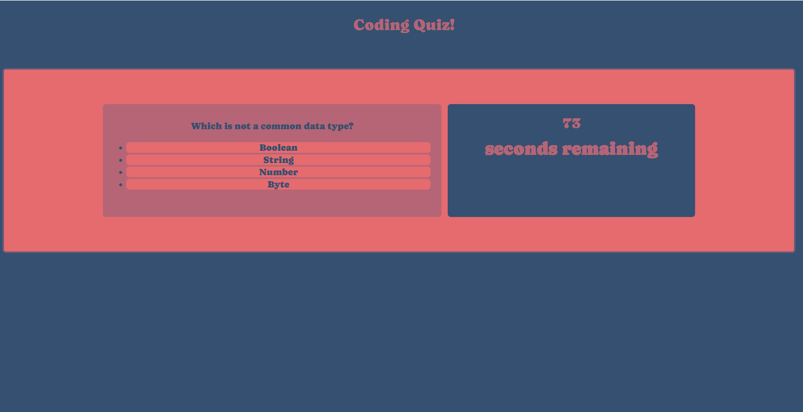
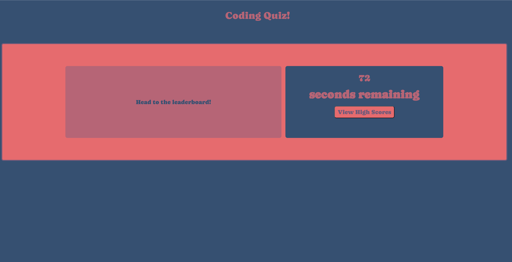
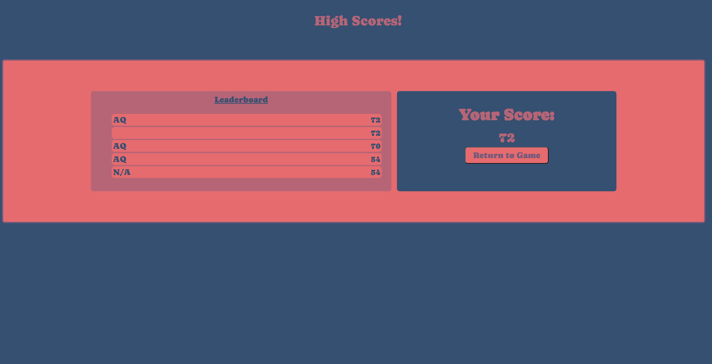
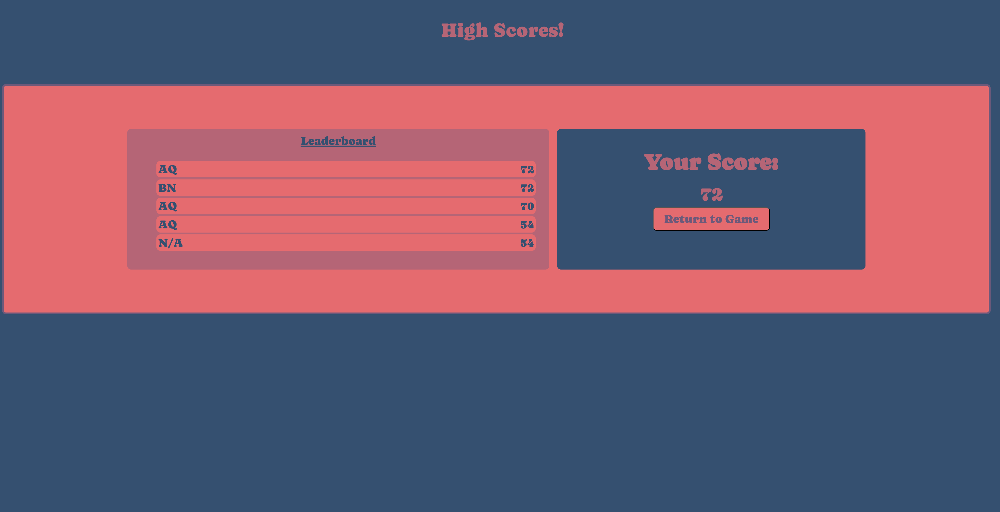

# Code-Quiz

## Description
A quiz for testing your coding knowledge! The fourth assignment in my coding bootcamp.

## How to Use

Navigate to the webpage here: https://andreasq99.github.io/Code-Quiz/

To begin the game, click the start button! Once the game starts, you will have 75 seconds to answer all the questions.

Once the game is over, you will be presented with your score and a button to head to the leaderboard page.

If you made it on the leaderboard, you can input your initials, just hit the keys you want to input!

Once you have inputted your initials, you can head back to the main page to try again. If you leave early, "N/A" will be inputted as the initials for your score.

## Credits
I used a ton of Mozilla, Github, and W3 resources to learn how to code this. The code for sorting the leaderboard is based on this article from [geeksforgeeks.org](https://www.geeksforgeeks.org/bubble-sort/).

## License
This webpage uses the MIT license.
